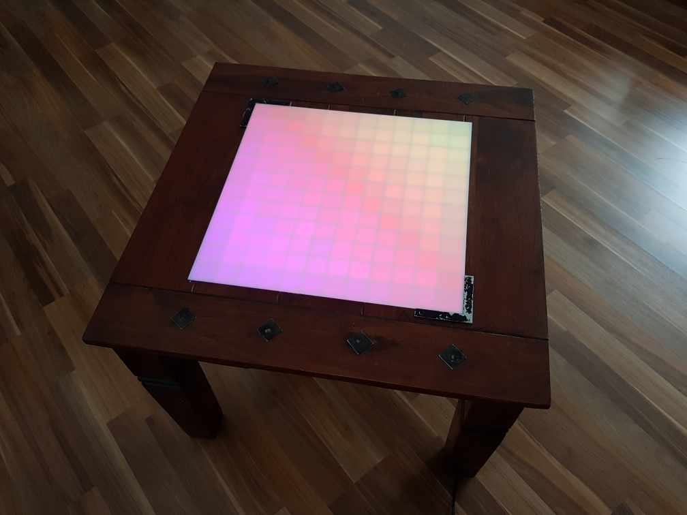

# LEDTable
LEDTable powered by ESP8266

Metallic decorations used as capacitive buttons...

# Looks like this (some examples):

Rainbow animation:

Diamond animation:

Falling Objects animation:

Plasma animation:

Tetris game:

Connect Four game:

Snake game:

Starship game (don't get hit by the starships):

Pong game (No, not two balls. Just shot the photo during movement...):

Test screen:

Plasma 2 animation:

Plasma 2 without cover:

Grid:

Table:

No grid animations:

Table top:

Table bottom:

PCB with ESP:

Capacitive buttons:

Power supply: 

PCB: 

